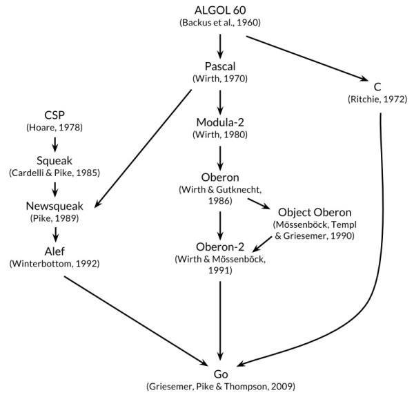

## Go語言起源

編程語言的演化就像生物物種的演化類似，一個成功的編程語言的後代一般都會繼承它們祖先的優點；當然有時多種語言雜合也可能會産生令人驚訝的特性；還有一些激進的新特性可能併沒有先例。我們可以通過觀察編程語言和軟硬件環境是如何相互促進、相互影響的演化過程而學到很多。

下圖展示了有哪些早期的編程語言對Go語言的設計産生了重要影響。

Go語言有時候被描述爲“C類似語言”，或者是“21世紀的C語言”。Go從C語言繼承了相似的表達式語法、控製流結構、基礎數據類型、調用參數傳值、指針等很多思想，還有C語言一直所看中的編譯後機器碼的運行效率以及和現有操作繫統的無縫適配。

但是在Go語言的家族樹中還有其它的祖先。其中一個有影響力的分支來自[Niklaus Wirth](https://en.wikipedia.org/wiki/Niklaus_Wirth)所設計的[Pascal](https://en.wikipedia.org/wiki/Pascal_(programming_language))語言。然後[Modula-2](https://en.wikipedia.org/wiki/Modula-2)語言激發了包的概念。然後[Oberon](https://en.wikipedia.org/wiki/Oberon_(programming_language))語言摒棄了模塊接口文件和模塊實現文件之間的區别。第二代的[Oberon-2](https://en.wikipedia.org/wiki/Oberon-2_(programming_language))語言直接影響了包的導入和聲明的語法，還有[Oberon](https://en.wikipedia.org/wiki/Oberon_(programming_language))語言的面向對象特性所提供的方法的聲明語法等。

Go語言的另一支祖先，帶來了Go語言區别其他語言的重要特性，靈感來自於貝爾實驗室的[Tony Hoare](https://en.wikipedia.org/wiki/Tony_Hoare)於1978年發表的鮮爲外界所知的關於併發研究的基礎文獻 *順序通信進程* （ [*communicating sequential processes*](https://en.wikipedia.org/wiki/Communicating_sequential_processes) ，縮寫爲CSP）。在CSP中，程序是一組中間沒有共享狀態的平行運行的處理過程，它們之間使用管道進行通信和控製同步。不過[Tony Hoare](https://en.wikipedia.org/wiki/Tony_Hoare)的CSP隻是一個用於描述併發性基本概念的描述語言，併不是一個可以編寫可執行程序的通用編程語言。

接下來，Rob Pike和其他人開始不斷嚐試將CSP引入實際的編程語言中。他們第一次嚐試引入CSP特性的編程語言叫[Squeak](http://doc.cat-v.org/bell_labs/squeak/)（老鼠間交流的語言），是一個提供鼠標和鍵盤事件處理的編程語言，它的管道是靜態創建的。然後是改進版的[Newsqueak](http://doc.cat-v.org/bell_labs/squeak/)語言，提供了類似C語言語句和表達式的語法和類似Pascal語言的推導語法。Newsqueak是一個帶垃圾迴收的純函數式語言，它再次針對鍵盤、鼠標和窗口事件管理。但是在Newsqueak語言中管道是動態創建的，屬於第一類值, 可以保存到變量中。

在Plan9操作繫統中，這些優秀的想法被吸收到了一個叫[Alef](http://doc.cat-v.org/plan_9/2nd_edition/papers/alef/)的編程語言中。Alef試圖將Newsqueak語言改造爲繫統編程語言，但是因爲缺少垃圾迴收機製而導致併發編程很痛苦。（譯註：在Aelf之後還有一個叫[Limbo](http://doc.cat-v.org/inferno/4th_edition/limbo_language/)的編程語言，Go語言從其中借鑒了很多特性。 具體請參考Pike的講稿：http://talks.golang.org/2012/concurrency.slide#9 ）

Go語言的其他的一些特性零散地來自於其他一些編程語言；比如iota語法是從[APL](https://en.wikipedia.org/wiki/APL_(programming_language))語言借鑒，詞法作用域與嵌套函數來自於[Scheme](https://en.wikipedia.org/wiki/Scheme_(programming_language))語言（和其他很多語言）。當然，我們也可以從Go中發現很多創新的設計。比如Go語言的切片爲動態數組提供了有效的隨機存取的性能，這可能會讓人聯想到鏈表的底層的共享機製。還有Go語言新發明的defer語句。
