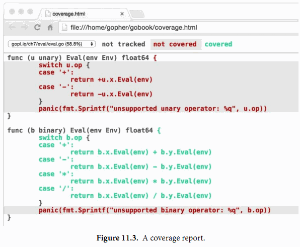

## 11.3. 測試覆蓋率


就其性質而言, 測試不可能是完整的. 計算機科學傢 Edsger Dijkstra 曾說過: "測試可以顯示存在缺陷, 但是並不是說沒有BUG." 再多的測試也不能証明一個包沒有BUG. 在最好的情況下, 測試可以增強我們的信息, 包在我們測試的環境是可以正常工作的.

由測試驅動觸發運行到的被測試函數的代碼數目稱爲測試的覆蓋率. 測試覆蓋率並不能量化 — 甚至連最簡單的動態程序也難以精確測量 — 但是可以啟發並幫助我們編寫的有效的測試代碼.

這些幫助信息中語句的覆蓋率是最簡單和最廣汎使用的. 語句的覆蓋率是指在測試中至少被運行一次的代碼佔總代碼數的比例. 在本節中, 我們使用 `go test` 中集成的測試覆蓋率工具, 來度量下面代碼的測試覆蓋率, 幫助我們識別測試和我們期望間的差距.

The code below is a table-driven test for the expression evaluator we built back in Chapter 7:

下面的代碼是一個表格驅動的測試, 用於測試第七章的表達式求值程序:

```Go
gopl.io/ch7/eval

func TestCoverage(t *testing.T) {
	var tests = []struct {
		input string
		env   Env
		want  string // expected error from Parse/Check or result from Eval
	}{
		{"x % 2", nil, "unexpected '%'"},
		{"!true", nil, "unexpected '!'"},
		{"log(10)", nil, `unknown function "log"`},
		{"sqrt(1, 2)", nil, "call to sqrt has 2 args, want 1"},
		{"sqrt(A / pi)", Env{"A": 87616, "pi": math.Pi}, "167"},
		{"pow(x, 3) + pow(y, 3)", Env{"x": 9, "y": 10}, "1729"},
		{"5 / 9 * (F - 32)", Env{"F": -40}, "-40"},
	}

	for _, test := range tests {
		expr, err := Parse(test.input)
		if err == nil {
			err = expr.Check(map[Var]bool{})
		}
		if err != nil {
			if err.Error() != test.want {
				t.Errorf("%s: got %q, want %q", test.input, err, test.want)
			}
			continue
		}
		got := fmt.Sprintf("%.6g", expr.Eval(test.env))
		if got != test.want {
			t.Errorf("%s: %v => %s, want %s",
				test.input, test.env, got, test.want)
		}
	}
}
```

首先, 我們要確保所有的測試都正常通過:

```
$ go test -v -run=Coverage gopl.io/ch7/eval
=== RUN TestCoverage
--- PASS: TestCoverage (0.00s)
PASS
ok      gopl.io/ch7/eval         0.011s
```

下面這個命令可以顯示測試覆蓋率工具的用法信息:

```
$ go tool cover
Usage of 'go tool cover':
Given a coverage profile produced by 'go test':
    go test -coverprofile=c.out

Open a web browser displaying annotated source code:
    go tool cover -html=c.out
...
```

`go tool` 命令運行Go工具鏈的底層可執行程序. 這些底層可執行程序放在 $GOROOT/pkg/tool/${GOOS}_${GOARCH} 目録. 因爲 `go build` 的原因, 我們很小直接調用這些底層工具.

現在我們可以用 `-coverprofile` 標誌參數重新運行:

```
$ go test -run=Coverage -coverprofile=c.out gopl.io/ch7/eval
ok      gopl.io/ch7/eval         0.032s      coverage: 68.5% of statements
```

這個標誌參數通過插入生成鉤子代碼來統計覆蓋率數據. 也就是說, 在運行每個測試前, 它會脩改要測試代碼的副本, 在每個塊都會設置一個佈爾標誌變量. 當被脩改後的被測試代碼運行退齣時, 將統計日誌數據寫入 c.out 文件, 並打印一部分執行的語句的一個總結. (如果你需要的是摘要,使用 `go test -cover`.)

如果使用了 `-covermode=count` 標誌參數, 那麽將在每個代碼塊插入一個計數器而不是佈爾標誌量. 在統計結果中記録了每個塊的執行次數, 這可以用於衡量哪些是被頻繁執行的熱點代碼.

爲了收集數據, 我們運行了測試覆蓋率工具, 打印了測試日誌, 生成一個HTML報告, 然後在瀏覽器中打開(圖11.3).

```
$ go tool cover -html=c.out
```



緑色的代碼塊被測試覆蓋到了, 紅色的則表示沒有被覆蓋到. 爲了清晰起見, 我們將的背景紅色文本的背景設置成了陰影效果. 我們可以馬上發現 unary 操作的 Eval 方法並沒有被執行到. 如果我們鍼對這部分未被覆蓋的代碼添加下面的測試, 然後重新運行上面的命令, 那麽我們將會看到那個紅色部分的代碼也變成緑色了:

```
{"-x * -x", eval.Env{"x": 2}, "4"}
```

不過兩個 panic 語句依然是紅色的. 這是沒有問題的, 因爲這兩個語句並不會被執行到.

實現 100% 的測試覆蓋率聽起來很好, 但是在具體實踐中通常是不可行的, 也不是值得推薦的做法. 因爲那隻能說明代碼被執行過而已, 並不意味着代碼是沒有BUG的; 因爲對於邏輯復雜的語句需要鍼對不同的輸入執行多次. 有一些語句, 例如上面的 panic 語句則永遠都不會被執行到. 另外, 還有一些隱晦的錯誤在現實中很少遇到也很難編寫對應的測試代碼. 測試從本質上來說是一個比較務實的工作, 編寫測試代碼和編寫應用代碼的成本對比是需要考慮的. 測試覆蓋率工具可以幫助我們快速識別測試薄弱的地方, 但是設計好的測試用例和編寫應用代碼一樣需要嚴密的思考.


