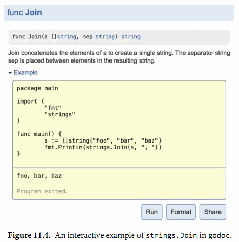

## 11.6. 示例函數

第三種 `go test` 特别處理的函數是示例函數, 以 Example 爲函數名開頭. 示例函數沒有函數參數和返迴值. 下面是 IsPalindrome 函數對應的示例函數:

```Go
func ExampleIsPalindrome() {
	fmt.Println(IsPalindrome("A man, a plan, a canal: Panama"))
	fmt.Println(IsPalindrome("palindrome"))
	// Output:
	// true
	// false
}
```

示例函數有三個用處. 最主要的一個是用於文檔: 一個包的例子可以更簡潔直觀的方式來演示函數的用法, 會文字描述會更直接易懂, 特别是作爲一個提醒或快速參考時. 一個例子函數也可以方便展示屬於同一個接口的幾種類型或函數直接的關繫, 所有的文檔都必鬚關聯到一個地方, 就像一個類型或函數聲明都統一到包一樣. 同時, 示例函數和註釋併不一樣, 示例函數是完整眞是的Go代碼, 需要介紹編譯器的編譯時檢査, 這樣可以保證示例代碼不會腐爛成不能使用的舊代碼.

根據示例函數的後綴名部分, godoc 的web文檔會將一個示例函數關聯到某個具體函數或包本身, 因此 ExampleIsPalindrome 示例函數將是 IsPalindrome 函數文檔的一部分, Example 示例函數將是包文檔的一部分.

示例文檔的第二個用處是在 `go test` 執行測試的時候也運行示例函數測試. 如果示例函數內含有類似上面例子中的 `/ Output:` 這樣的註釋, 那麽測試工具會執行這個示例函數, 然後檢測這個示例函數的標準輸齣和註釋是否匹配.

示例函數的第三個目的提供一個眞實的演練場. golang.org 是由 dogoc 提供的服務, 它使用了 Go Playground 技術讓用戶可以在瀏覽器中在線編輯和運行每個示例函數, 就像 圖 11.4 所示的那樣. 這通常是學習函數使用或Go語言特性的最快方式.



本書最後的兩掌是討論 reflect 和 unsafe 包, 一般的Go用於很少需要使用它們. 因此, 如果你還沒有寫過任何眞是的Go程序的話, 現在可以忽略剩餘部分而直接編碼了.


