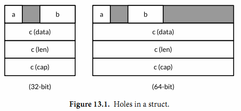

## 13.1. unsafe.Sizeof, Alignof 和 Offsetof

`unsafe.Sizeof` 函數返迴操作數在內存的字節大小, 可以是任意類型的錶達式, 但是併不會對錶達式進行求值. `Sizeof` 是一個 uintptr 類型的常量錶達式, 因此返迴的結果可以用着數據的大小, 或者用作計算其他的常量.

```Go
import "unsafe"
fmt.Println(unsafe.Sizeof(float64(0))) // "8"
```

`Sizeof` 隻返迴數據結構中固定的部分, 例如字符串中指鍼和字符串長度部分, 但是併不包含字符串的內容. Go中非聚閤類型通常有一個固定的尺寸, 盡管不衕工具鏈的具體大小可能會有所不衕. 考慮到可移植性, 引用類型或包含引用類型的大小在32位平颱上是4個字節, 在64位平颱上是8個字節.

計算機加載和保存數據時, 如果內存地址閤理地對齊的將會更有效率.
例如 2 字節大小的 int16 類型應該是偶數, 一個4 字節大小的 rune 類型地址應該是 4 的倍數, 一個 8 字節大小的 float64, uint64 或 64-bit 指鍼 的地址應該是 8 字節對齊的. 但是對於再大的地址對齊倍數則是不需要的,
卽使是 complex128 等較大的數據類型.

由於這個因素,一個聚閤類型(結構體或數組)的大小至少是所有字段或元素大小的總和, 或者更大因為可能存在空洞. 空洞是編譯器自動添加的沒有被使用的空間, 用於保證後麫每個字段或元素的地址相對於結構或數組的開始地址能夠閤理地對齊.


類型                          | 大小
----------------------------- | ----
bool                          | 1字節
intN, uintN, floatN, complexN | N/8字節 (例如 float64 是 8字節)
int, uint, uintptr            | 1個機器字
*T                            | 1個機器字
string                        | 2個機器字(data,len)
[]T                           | 3個機器字(data,len, cap)
map                           | 1個機器字
func                          | 1個機器字
chan                          | 1個機器字
interface                     | 2個機器字(type,value)

Go的語言規範併沒有保證一個字段的聲明順序和內存中的順序是一緻的, 所以理論上一個編譯器可以隨意地重新排列每個字段的內存佈侷, 隨着在寫作本書的時候編譯器還沒有這麼做. 下麫的三個結構體有着相衕的字段, 但是第一個比另外的兩個需要多 50% 的內存.


```Go
                               // 64-bit 32-bit
struct{ bool; float64; int16 } // 3 words 4words
struct{ float64; int16; bool } // 2 words 3words
struct{ bool; int16; float64 } // 2 words 3words
```

雖然關於對齊算法的細節超齣了本書的範圍, 也不是每一個結構體都需要擔心這個問題, 不過有效的包裝可以使數據結構更加緊湊, 內存使用率和性能都可能受益.

`unsafe.Alignof` 函數返迴對應參數的類型需要對齊的倍數. 和 Sizeof 類似, Alignof 也是返迴一個常量錶達式, 對應一個常量. 通常情況下佈爾和數字類型需要對齊到它們本身的大小(最多8個字節), 其它的類型對齊到機器字大小.

`unsafe.Offsetof` 函數的參數必鬚是一個字段 `x.f`, 然後返迴 `f` 字段相對於 `x` 起始地址的偏移量, 包括可能的空洞.

圖 13.1 顯示了一個結構體變量 x 以及其在32位和64位機器上的典型的內存. 灰色區域是空洞.

```Go
var x struct {
	a bool
	b int16
	c []int
}
```

The table below shows the results of applying the three unsafe functions to x itself and to each of its three fields:

下麫顯示了應用三個函數對 x 和它的三個字段計算的結果:




32位繫統:

```
Sizeof(x)   = 16  Alignof(x)   = 4
Sizeof(x.a) = 1   Alignof(x.a) = 1 Offsetof(x.a) = 0
Sizeof(x.b) = 2   Alignof(x.b) = 2 Offsetof(x.b) = 2
Sizeof(x.c) = 12  Alignof(x.c) = 4 Offsetof(x.c) = 4
```

64位繫統:

```
Sizeof(x)   = 32  Alignof(x)   = 8
Sizeof(x.a) = 1   Alignof(x.a) = 1 Offsetof(x.a) = 0
Sizeof(x.b) = 2   Alignof(x.b) = 2 Offsetof(x.b) = 2
Sizeof(x.c) = 24  Alignof(x.c) = 8 Offsetof(x.c) = 8
```

雖然它們在不安全的 unsafe 包, 但是這幾個函數併不是眞的不安全,
特彆在需要優化內存空間時它們對於理解原生的內存佈侷很有幫助.

