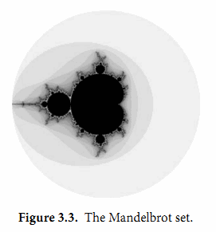

## 3.3. 複數

Go語言提供了兩種精度的複數類型：complex64和complex128，分别對應float32和float64兩種浮點數精度。內置的complex函數用於構建複數，內建的real和imag函數分别返迴複數的實部和虛部：

```Go
var x complex128 = complex(1, 2) // 1+2i
var y complex128 = complex(3, 4) // 3+4i
fmt.Println(x*y)                 // "(-5+10i)"
fmt.Println(real(x*y))           // "-5"
fmt.Println(imag(x*y))           // "10"
```

如果一個浮點數面值或一個十進製整數面值後面跟着一個i，例如3.141592i或2i，它將構成一個複數的虛部，複數的實部是0：

```Go
fmt.Println(1i * 1i) // "(-1+0i)", i^2 = -1
```

在常量算術規則下，一個複數常量可以加到另一個普通數值常量（整數或浮點數、實部或虛部），我們可以用自然的方式書寫複數，就像1+2i或與之等價的寫法2i+1。上面x和y的聲明語句還可以簡化：

```Go
x := 1 + 2i
y := 3 + 4i
```

複數也可以用==和!=進行相等比較。隻有兩個複數的實部和虛部都相等的時候它們才是相等的（譯註：浮點數的相等比較是危險的，需要特别小心處理精度問題）。

math/cmplx包提供了複數處理的許多函數，例如求複數的平方根函數和求冪函數。

```Go
fmt.Println(cmplx.Sqrt(-1)) // "(0+1i)"
```

下面的程序使用complex128複數算法來生成一個Mandelbrot圖像。

```Go
gopl.io/ch3/mandelbrot

// Mandelbrot emits a PNG image of the Mandelbrot fractal.
package main

import (
	"image"
	"image/color"
	"image/png"
	"math/cmplx"
	"os"
)


func main() {
	const (
		xmin, ymin, xmax, ymax = -2, -2, +2, +2
		width, height          = 1024, 1024
	)

	img := image.NewRGBA(image.Rect(0, 0, width, height))
	for py := 0; py < height; py++ {
		y := float64(py)/height*(ymax-ymin) + ymin
		for px := 0; px < width; px++ {
			x := float64(px)/width*(xmax-xmin) + xmin
			z := complex(x, y)
			// Image point (px, py) represents complex value z.
			img.Set(px, py, mandelbrot(z))
		}
	}
	png.Encode(os.Stdout, img) // NOTE: ignoring errors
}

func mandelbrot(z complex128) color.Color {
	const iterations = 200
	const contrast = 15

	var v complex128
	for n := uint8(0); n < iterations; n++ {
		v = v*v + z
		if cmplx.Abs(v) > 2 {
			return color.Gray{255 - contrast*n}
		}
	}
	return color.Black
}
```

用於遍歷1024x1024圖像每個點的兩個嵌套的循環對應-2到+2區間的複數平面。程序反複測試每個點對應複數值平方值加一個增量值對應的點是否超出半徑爲2的圓。如果超過了，通過根據預設置的逃逸迭代次數對應的灰度顔色來代替。如果不是，那麽該點屬於Mandelbrot集合，使用黑色顔色標記。最終程序將生成的PNG格式分形圖像圖像輸出到標準輸出，如圖3.3所示。



**練習 3.5：** 實現一個綵色的Mandelbrot圖像，使用image.NewRGBA創建圖像，使用color.RGBA或color.YCbCr生成顔色。

**練習 3.6：** 陞采樣技術可以降低每個像素對計算顔色值和平均值的影響。簡單的方法是將每個像素分層四個子像素，實現它。

**練習 3.7：** 另一個生成分形圖像的方式是使用牛頓法來求解一個複數方程，例如$$z^4-1=0$$。每個起點到四個根的迭代次數對應陰影的灰度。方程根對應的點用顔色表示。

**練習 3.8：** 通過提高精度來生成更多級别的分形。使用四種不同精度類型的數字實現相同的分形：complex64、complex128、big.Float和big.Rat。（後面兩種類型在math/big包聲明。Float是有指定限精度的浮點數；Rat是無效精度的有理數。）它們間的性能和內存使用對比如何？當渲染圖可見時縮放的級别是多少？

**練習 3.9：** 編寫一個web服務器，用於給客戶端生成分形的圖像。運行客戶端用過HTTP參數參數指定x,y和zoom參數。


