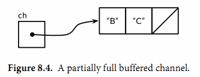

### 8.4.4. 帶緩存的Channels

帶緩存的Channel內部持有一個元素隊列。隊列的最大容量是在調用make函數創建channel時通過第二個參數指定的。下面的語句創建了一個可以持有三個字符串元素的帶緩存Channel。圖8.2是ch變量對應的channel的圖形表示形式。

```Go
ch = make(chan string, 3)
```


向緩存Channel的發送操作就是向內部緩存隊列的尾部插入原因，接收操作則是從隊列的頭部刪除元素。如果內部緩存隊列是滿的，那麽發送操作將阻塞直到因另一個goroutine執行接收操作而釋放了新的隊列空間。相反，如果channel是空的，接收操作將阻塞直到有另一個goroutine執行發送操作而向隊列插入元素。

我們可以在無阻塞的情況下連續向新創建的channel發送三個值：

```Go
ch <- "A"
ch <- "B"
ch <- "C"
```

此刻，channel的內部緩存隊列將是滿的（圖8.3），如果有第四個發送操作將發生阻塞。


如果我們接收一個值，

```Go
fmt.Println(<-ch) // "A"
```

那麽channel的緩存隊列將不是滿的也不是空的（圖8.4），因此對該channel執行的發送或接收操作都不會發送阻塞。通過這種方式，channel的緩存隊列解耦了接收和發送的goroutine。



在某些特殊情況下，程序可能需要知道channel內部緩存的容量，可以用內置的cap函數獲取：

```Go
fmt.Println(cap(ch)) // "3"
```

同樣，對於內置的len函數，如果傳入的是channel，那麽將返迴channel內部緩存隊列中有效元素的個數。因爲在併發程序中該信息會隨着接收操作而失效，但是它對某些故障診斷和性能優化會有幫助。

```Go
fmt.Println(len(ch)) // "2"
```

在繼續執行兩次接收操作後channel內部的緩存隊列將又成爲空的，如果有第四個接收操作將發生阻塞：

```Go
fmt.Println(<-ch) // "B"
fmt.Println(<-ch) // "C"
```

在這個例子中，發送和接收操作都發生在同一個goroutine中，但是在眞是的程序中它們一般由不同的goroutine執行。Go語言新手有時候會將一個帶緩存的channel當作同一個goroutine中的隊列使用，雖然語法看似簡單，但實際上這是一個錯誤。Channel和goroutine的調度器機製是緊密相連的，一個發送操作——或許是整個程序——可能會永遠阻塞。如果你隻是需要一個簡單的隊列，使用slice就可以了。

下面的例子展示了一個使用了帶緩存channel的應用。它併發地向三個鏡像站點發出請求，三個鏡像站點分散在不同的地理位置。它們分别將收到的響應發送到帶緩存channel，最後接收者隻接收第一個收到的響應，也就是最快的那個響應。因此mirroredQuery函數可能在另外兩個響應慢的鏡像站點響應之前就返迴了結果。（順便説一下，多個goroutines併發地向同一個channel發送數據，或從同一個channel接收數據都是常見的用法。）

```Go
func mirroredQuery() string {
	responses := make(chan string, 3)
	go func() { responses <- request("asia.gopl.io") }()
	go func() { responses <- request("europe.gopl.io") }()
	go func() { responses <- request("americas.gopl.io") }()
	return <-responses // return the quickest response
}

func request(hostname string) (response string) { /* ... */ }
```

如果我們使用了無緩存的channel，那麽兩個慢的goroutines將會因爲沒有人接收而被永遠卡住。這種情況，稱爲goroutines洩漏，這將是一個BUG。和垃圾變量不同，洩漏的goroutines併不會被自動迴收，因此確保每個不再需要的goroutine能正常退出是重要的。

關於無緩存或帶緩存channels之間的選擇，或者是帶緩存channels的容量大小的選擇，都可能影響程序的正確性。無緩存channel更強地保證了每個發送操作與相應的同步接收操作；但是對於帶緩存channel，這些操作是解耦的。同樣，卽使我們知道將要發送到一個channel的信息的數量上限，創建一個對應容量大小帶緩存channel也是不現實的，因爲這要求在執行任何接收操作之前緩存所有已經發送的值。如果未能分配足夠的緩衝將導致程序死鎖。

Channel的緩存也可能影響程序的性能。想象一家蛋糕店有三個廚師，一個烘焙，一個上糖衣，還有一個將每個蛋糕傳遞到它下一個廚師在生産線。在狹小的廚房空間環境，每個廚師在完成蛋糕後必須等待下一個廚師已經準備好接受它；這類似於在一個無緩存的channel上進行溝通。

如果在每個廚師之間有一個放置一個蛋糕的額外空間，那麽每個廚師就可以將一個完成的蛋糕臨時放在那里而馬上進入下一個蛋糕在製作中；這類似於將channel的緩存隊列的容量設置爲1。隻要每個廚師的平均工作效率相近，那麽其中大部分的傳輸工作將是迅速的，個體之間細小的效率差異將在交接過程中瀰補。如果廚師之間有更大的額外空間——也是就更大容量的緩存隊列——將可以在不停止生産線的前提下消除更大的效率波動，例如一個廚師可以短暫地休息，然後在加快趕上進度而不影響其其他人。

另一方面，如果生産線的前期階段一直快於後續階段，那麽它們之間的緩存在大部分時間都將是滿的。相反，如果後續階段比前期階段更快，那麽它們之間的緩存在大部分時間都將是空的。對於這類場景，額外的緩存併沒有帶來任何好處。

生産線的隱喻對於理解channels和goroutines的工作機製是很有幫助的。例如，如果第二階段是需要精心製作的複雜操作，一個廚師可能無法跟上第一個廚師的進度，或者是無法滿足第階段廚師的需求。要解決這個問題，我們可以雇傭另一個廚師來幫助完成第二階段的工作，他執行相同的任務但是獨立工作。這類似於基於相同的channels創建另一個獨立的goroutine。

我們沒有太多的空間展示全部細節，但是gopl.io/ch8/cake包模擬了這個蛋糕店，可以通過不同的參數調整。它還對上面提到的幾種場景提供對應的基準測試（§11.4） 。


